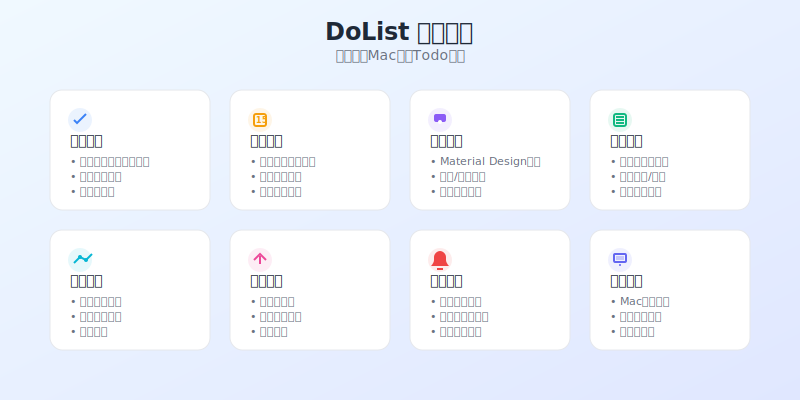

# DoList - 现代化Mac桌面Todo应用

<div align="center">
  
  
  <h3>简洁高效的任务管理工具</h3>
  <p>专为Mac用户设计的现代化Todo应用，具备智能提醒和优雅界面</p>
  
  
  
  
</div>

## 📱 应用预览

<div align="center">
  
</div>

## ✨ 核心功能

<div align="center">
  
</div>

### 🎯 任务管理
- **智能任务创建** - 快速添加任务，支持标题、描述和截止日期
- **灵活状态管理** - 一键切换任务完成状态
- **优先级设置** - 高、中、低三级优先级标识
- **任务编辑** - 双击编辑，支持实时修改任务信息
- **批量操作** - 支持批量删除和状态更新

### ⏰ 截止期限与提醒
- **智能提醒系统** - 基于系统通知的任务提醒
- **过期任务高亮** - 自动标识过期任务，红色警示
- **即将到期预警** - 提前提醒即将到期的任务
- **自定义提醒时间** - 灵活设置提醒间隔
- **通知权限管理** - 一键开启/关闭通知功能

### 🎨 现代化界面
- **Material Design** - 遵循现代设计规范
- **深色/浅色主题** - 自动跟随系统主题或手动切换
- **流畅动画效果** - 基于Framer Motion的丝滑过渡
- **响应式布局** - 适配不同窗口尺寸
- **毛玻璃效果** - 现代化的视觉层次

### 📊 数据管理
- **本地数据持久化** - 基于SQLite的可靠存储
- **数据导入/导出** - JSON格式的数据备份
- **自动保存** - 实时保存，无需手动操作
- **数据统计** - 任务完成率和效率分析
- **搜索过滤** - 快速查找特定任务

## 🛠 技术栈

### 核心框架
- **[Electron](https://electronjs.org/)** - 跨平台桌面应用框架
- **[React 18](https://reactjs.org/)** - 现代化前端框架
- **[TypeScript](https://typescriptlang.org/)** - 类型安全的JavaScript
- **[Vite](https://vitejs.dev/)** - 快速构建工具

### UI & 样式
- **[Tailwind CSS](https://tailwindcss.com/)** - 实用优先的CSS框架
- **[Framer Motion](https://framer.com/motion/)** - 流畅动画库
- **[Lucide React](https://lucide.dev/)** - 现代化图标库
- **[React Hot Toast](https://react-hot-toast.com/)** - 优雅的通知组件

### 状态管理 & 数据
- **[Zustand](https://zustand-demo.pmnd.rs/)** - 轻量级状态管理
- **[SQLite3](https://sqlite.org/)** - 本地数据库
- **[date-fns](https://date-fns.org/)** - 日期处理库
- **[React Hook Form](https://react-hook-form.com/)** - 高性能表单库

### 开发工具
- **[ESLint](https://eslint.org/)** + **[Prettier](https://prettier.io/)** - 代码规范
- **[electron-builder](https://electron.build/)** - 应用打包工具

## 🚀 快速开始

### 环境要求
- **Node.js** >= 16.0.0
- **npm** >= 8.0.0
- **macOS** >= 10.15 (Catalina)

### 安装步骤

1. **克隆项目**
   ```bash
   git clone https://github.com/NewToolAI/dolist.git
   cd dolist
   ```

2. **安装依赖**
   ```bash
   npm install
   ```

3. **启动开发服务器**
   ```bash
   npm run dev
   ```

4. **构建生产版本**
   ```bash
   npm run build
   ```

5. **打包应用**
   ```bash
   npm run dist
   ```

### 开发模式
```bash
# 启动开发环境（热重载）
npm run dev

# 仅构建渲染进程
npm run build:renderer

# 仅构建主进程
npm run build:main
```

## 📁 项目结构

```
dolist/
├── src/
│   ├── main/                 # Electron 主进程
│   │   ├── main.ts          # 应用入口
│   │   └── utils.ts         # 工具函数
│   ├── preload/             # 预加载脚本
│   │   └── preload.ts       # 安全的API桥接
│   ├── renderer/            # React 渲染进程
│   │   ├── src/
│   │   │   ├── components/  # React 组件
│   │   │   ├── store/       # Zustand 状态管理
│   │   │   ├── services/    # 业务服务
│   │   │   └── App.tsx      # 主应用组件
│   │   └── index.html       # HTML 模板
│   └── shared/              # 共享类型和工具
│       └── types.ts         # TypeScript 类型定义
├── assets/                  # 静态资源
│   ├── icon.icns           # 应用图标
│   └── app-icon.svg        # SVG 图标
├── docs/                   # 文档和插图
│   ├── app-demo.svg        # 应用演示图
│   └── features-overview.svg # 功能概览图
├── package.json            # 项目配置
├── vite.config.ts         # Vite 配置
├── tailwind.config.js     # Tailwind 配置
└── tsconfig.json          # TypeScript 配置
```

## 🎮 使用指南

### 基本操作

1. **添加任务**
   - 在顶部输入框中输入任务标题
   - 可选择设置截止日期
   - 点击"添加"按钮或按回车键

2. **管理任务**
   - 点击圆圈图标标记任务完成
   - 双击任务进入编辑模式
   - 点击删除按钮移除任务

3. **过滤和搜索**
   - 使用左侧过滤器查看不同状态的任务
   - 在搜索框中输入关键词快速查找

4. **主题切换**
   - 点击右上角月亮/太阳图标切换主题
   - 支持跟随系统主题设置

### 快捷键

| 快捷键 | 功能 |
|--------|------|
| `Cmd + N` | 新建任务 |
| `Cmd + D` | 删除选中任务 |
| `Cmd + E` | 编辑选中任务 |
| `Cmd + F` | 搜索任务 |
| `Cmd + ,` | 打开设置 |
| `Cmd + T` | 切换主题 |

### 通知设置

1. **启用通知**
   - 首次使用时会请求通知权限
   - 在设置中可以开启/关闭通知功能

2. **提醒时间**
   - 支持设置多个提醒时间点
   - 默认在截止前1小时、1天提醒

## 📊 数据管理

### 数据存储
- 所有数据存储在本地SQLite数据库中
- 数据文件位置：`~/Library/Application Support/DoList/`
- 支持自动备份和恢复

### 导入/导出
```bash
# 导出数据
设置 → 数据管理 → 导出数据

# 导入数据
设置 → 数据管理 → 导入数据
```

### 数据格式
```json
{
  "version": "1.0.0",
  "exportDate": "2024-01-15T10:30:00Z",
  "todos": [
    {
      "id": "1",
      "title": "完成项目文档",
      "description": "编写详细的README文档",
      "completed": false,
      "priority": "high",
      "dueDate": "2024-01-20T18:00:00Z",
      "createdAt": "2024-01-15T10:00:00Z",
      "updatedAt": "2024-01-15T10:00:00Z"
    }
  ]
}
```

## 🔧 配置选项

### 应用设置
```typescript
interface AppSettings {
  theme: 'light' | 'dark' | 'system'    // 主题设置
  notifications: boolean                 // 通知开关
  autoSave: boolean                     // 自动保存
  reminderMinutes: number[]             // 提醒时间（分钟）
}
```

### 自定义配置
- 配置文件：`~/Library/Preferences/com.dolist.app.plist`
- 支持通过设置界面修改
- 重启应用后生效

## 🚀 性能优化

### 应用性能
- **启动时间** < 2秒
- **内存占用** < 100MB
- **CPU使用率** < 5%（空闲时）

### 优化特性
- 虚拟滚动处理大量任务
- 防抖搜索减少性能开销
- 懒加载组件提升响应速度
- 智能缓存减少重复计算

## 🛡 安全性

### 数据安全
- 所有数据存储在本地，不上传云端
- SQLite数据库加密存储
- 支持数据备份和恢复

### 权限管理
- 最小权限原则
- 仅请求必要的系统权限
- 通知权限可选开启

## 🤝 贡献指南

### 开发环境设置
1. Fork 项目到你的GitHub账户
2. 克隆你的Fork到本地
3. 创建新的功能分支
4. 提交你的更改
5. 推送到你的Fork
6. 创建Pull Request

### 代码规范
- 使用ESLint和Prettier保持代码风格一致
- 遵循TypeScript最佳实践
- 编写有意义的提交信息
- 添加适当的测试用例

### 提交规范
```
feat: 添加新功能
fix: 修复bug
docs: 更新文档
style: 代码格式调整
refactor: 代码重构
test: 添加测试
chore: 构建过程或辅助工具的变动
```

## 📝 更新日志

### v1.0.0 (2024-01-15)
- 🎉 首次发布
- ✨ 基础任务管理功能
- ⏰ 截止期限和提醒系统
- 🎨 现代化界面设计
- 📊 数据统计和分析
- 🔔 系统通知集成

### 即将推出
- 📱 iOS/Android 同步
- 🏷 任务标签系统
- 📈 更详细的统计报告
- 🔄 云端同步功能
- 🎯 任务模板

## 🐛 问题反馈

如果你遇到任何问题或有功能建议，请通过以下方式联系我们：

- **GitHub Issues**: [提交问题](https://github.com/NewToolAI/dolist/issues)
- **邮箱**: support@dolist.app
- **讨论区**: [GitHub Discussions](https://github.com/NewToolAI/dolist/discussions)

### 常见问题

**Q: 应用无法启动怎么办？**
A: 请确保你的macOS版本 >= 10.15，并且已安装最新版本的应用。

**Q: 通知不工作怎么办？**
A: 请检查系统设置中的通知权限，确保DoList已被允许发送通知。

**Q: 如何备份我的数据？**
A: 在设置中选择"导出数据"，将数据保存为JSON文件。

**Q: 支持其他平台吗？**
A: 目前仅支持macOS，Windows和Linux版本正在开发中。

## 📄 许可证

本项目采用 [MIT 许可证](LICENSE)。

```
MIT License

Copyright (c) 2024 DoList Team

Permission is hereby granted, free of charge, to any person obtaining a copy
of this software and associated documentation files (the "Software"), to deal
in the Software without restriction, including without limitation the rights
to use, copy, modify, merge, publish, distribute, sublicense, and/or sell
copies of the Software, and to permit persons to whom the Software is
furnished to do so, subject to the following conditions:

The above copyright notice and this permission notice shall be included in all
copies or substantial portions of the Software.

THE SOFTWARE IS PROVIDED "AS IS", WITHOUT WARRANTY OF ANY KIND, EXPRESS OR
IMPLIED, INCLUDING BUT NOT LIMITED TO THE WARRANTIES OF MERCHANTABILITY,
FITNESS FOR A PARTICULAR PURPOSE AND NONINFRINGEMENT. IN NO EVENT SHALL THE
AUTHORS OR COPYRIGHT HOLDERS BE LIABLE FOR ANY CLAIM, DAMAGES OR OTHER
LIABILITY, WHETHER IN AN ACTION OF CONTRACT, TORT OR OTHERWISE, ARISING FROM,
OUT OF OR IN CONNECTION WITH THE SOFTWARE OR THE USE OR OTHER DEALINGS IN THE
SOFTWARE.
```

## 🙏 致谢

感谢以下开源项目和社区的支持：

- [Electron](https://electronjs.org/) - 跨平台桌面应用框架
- [React](https://reactjs.org/) - 用户界面库
- [Tailwind CSS](https://tailwindcss.com/) - CSS框架
- [Framer Motion](https://framer.com/motion/) - 动画库
- [Zustand](https://zustand-demo.pmnd.rs/) - 状态管理
- [Lucide](https://lucide.dev/) - 图标库

---

<div align="center">
  <p>用 ❤️ 制作 by DoList Team</p>
  <p>
    <a href="https://github.com/NewToolAI/dolist">GitHub</a> •
    <a href="https://dolist.app">官网</a> •
    <a href="mailto:support@dolist.app">联系我们</a>
  </p>
</div>