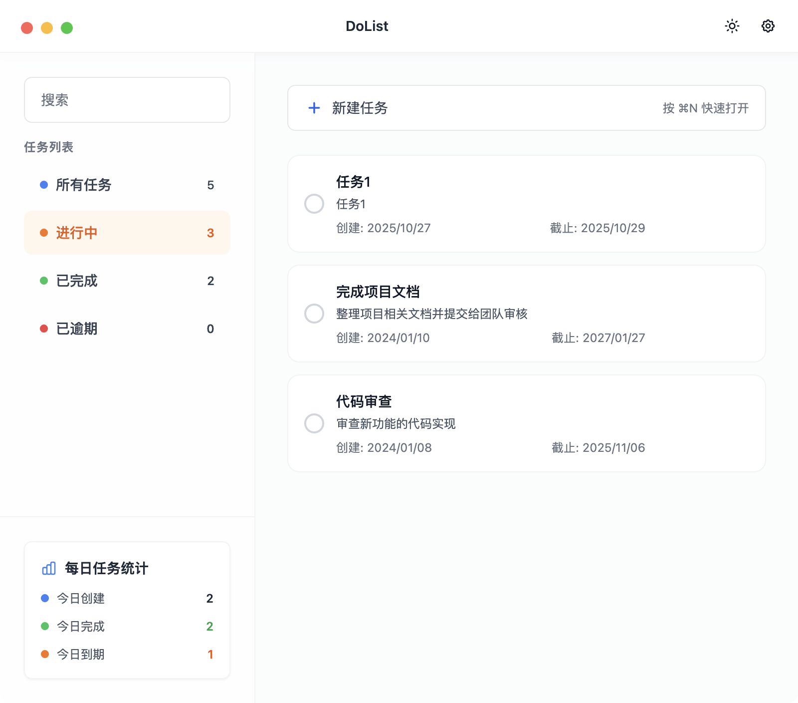

<div align="center">

# 📝 DoList


**一个基于 Electron + React + Vite 的简单、可用的桌面待办应用（面向 macOS）**

支持基础的任务管理、筛选、搜索、到期提醒、导入导出和深浅色主题

[](https://github.com/your-username/dolist)
[](LICENSE)
[](https://www.apple.com/macos/)
[](https://electronjs.org/)
[](https://reactjs.org/)
[](https://www.typescriptlang.org/)

</div>

## 预览截图



## ✨ 功能特性

<table>
<tr>
<td width="50%">

### 📋 任务管理
- ✅ 添加、编辑、删除、勾选完成任务
- 🔍 关键词搜索（标题与描述）
- 🎯 拖拽调整任务顺序
- 📅 可选截止日期设置

</td>
<td width="50%">

### 🎨 界面体验
- 🌓 深色/浅色/跟随系统主题
- 📊 日常统计面板
- 🔔 到期与提前提醒
- 💾 数据导入/导出（JSON 文件）

</td>
</tr>
<tr>
<td width="50%">

### 🏷️ 任务筛选
- 📝 全部任务
- ⏳ 进行中任务
- ✅ 已完成任务
- ⚠️ 已逾期任务

</td>
<td width="50%">

### ⏰ 提醒功能
- 🔔 15 分钟提前提醒
- ⏰ 1 小时提前提醒
- 📅 24 小时提前提醒
- 📈 完成率统计

</td>
</tr>
</table>

> 说明：当前版本的数据保存在浏览器的 `localStorage` 中，未接入云同步或账号体系。`sqlite3` 依赖存在，但目前代码中未使用。

## 🚀 快速开始

### 📋 环境要求
- 💻 建议使用 `Node.js 18+` 与 `npm`

### 📦 安装依赖
```bash
npm install
```

### 🛠️ 开发模式
自动启动渲染端和主进程：
```bash
npm run dev
```

### 🏗️ 构建生产包
构建渲染端与主进程：
```bash
npm run build
```

### 📱 打包为 macOS 应用
生成 DMG 安装包：
```bash
npm run dist
```
📁 产物位于 `release/` 目录

## 🛠️ 技术栈

<div align="center">

| 类别 | 技术 | 描述 |
|------|------|------|
| 🖥️ **桌面框架** | [](https://electronjs.org/) | 跨平台桌面应用框架 |
| ⚛️ **前端框架** | [](https://reactjs.org/) | 用户界面构建库 |
| ⚡ **构建工具** | [](https://vitejs.dev/) | 快速的前端构建工具 |
| 📝 **开发语言** | [](https://www.typescriptlang.org/) | 类型安全的 JavaScript |
| 🎨 **样式框架** | [](https://tailwindcss.com/) | 实用优先的 CSS 框架 |
| 🗃️ **状态管理** | [](https://github.com/pmndrs/zustand) | 轻量级状态管理库 |

### 📚 核心依赖

- 🔧 **react-hook-form** - 高性能表单库
- 🍞 **react-hot-toast** - 优雅的通知组件
- 📅 **date-fns** - 现代化日期工具库
- 🎯 **lucide-react** - 精美的图标库
- 🎭 **framer-motion** - 流畅的动画库

</div>

## 📁 目录结构

```
📦 DoList
├── 📂 src/
│   ├── 🖥️ main/          # Electron 主进程代码（窗口、菜单、环境判断等）
│   ├── 🔗 preload/       # 预加载脚本（安全暴露 API）
│   ├── 🎨 renderer/      # 前端界面（React + Tailwind）
│   └── 🔄 shared/        # 共享类型定义
├── 🏗️ dist/             # 构建输出（开发/生产）
├── 📦 release/           # 打包输出（DMG 等）
├── 🎨 assets/            # 应用图标和资源文件
└── 📚 docs/              # 文档和截图
```

## ⚠️ 已知限制

<div align="left">

| 限制项 | 说明 |
|--------|------|
| 🖥️ **平台支持** | 打包配置当前主要面向 `macOS (arm64)`，其他平台未验证 |
| 🔔 **通知权限** | 通知功能依赖系统/浏览器通知权限，需要用户允许后才会生效 |
| 💾 **存储限制** | `localStorage` 容量有限，不适合大量数据或多设备同步场景 |
| ☁️ **云同步** | 暂不包含用户登录、云同步、多设备协同等功能 |

</div>

---

## 📄 许可证

<div align="center">

[](https://opensource.org/licenses/MIT)

**采用 MIT 许可证** - 详见 `package.json` 中的 `license` 字段

*自由使用、修改和分发* 🎉

</div>